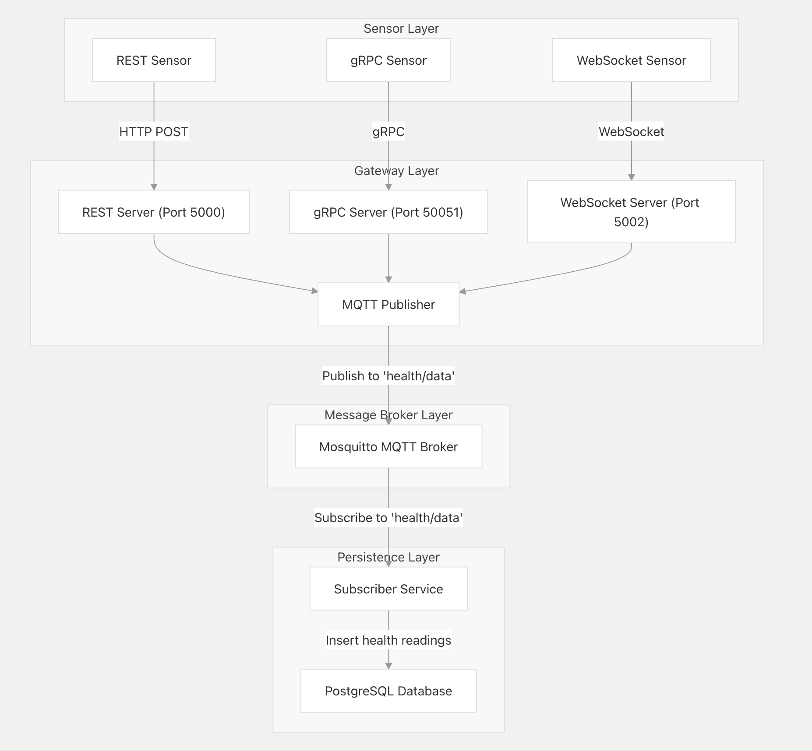
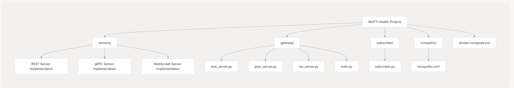

# MQTT-Health-Project
An IoT project where we simulate multiple health sensors and publish them with REST, gRPC and WebSockets using Mosquitto Broker with MQTT protocol to obtain the data and store it in a PostgreSQL database, simulating the publisher-subscriber method of the protocol, all integrated into a Docker Compose.

## Components

- [`gateway/`](./mqtt-health-project/gateway): Unified server receiving data via REST, gRPC, and WebSocket
- [`sensors/`](./mqtt-health-project/sensors): Simulated health data publishers
- [`subscriber/`](./mqtt-health-project/subscriber): Persists MQTT messages into PostgreSQL
- [`docker-compose.yml`](./mqtt-health-project/docker-compose.yml): Launches all services and manages networking

---
---

## System Architecture

The following diagram represents the high-level system architecture. It shows the relationship between sensors, the unified gateway, the MQTT broker, the subscriber, and the PostgreSQL database.

<p align="center">
  
</p>

---

## Component-Code Relationship

This diagram maps each component of the architecture to its corresponding folder and main files in the codebase.

<p align="center">
  
</p>


---

## Gateway

👉 [Detailed gateway README here](./mqtt-health-project/gateway/README.md)

Summary:
- Runs REST on port 5000
- Runs gRPC on port 50051
- Runs WebSocket on port 5002
- Publishes to MQTT topic `health/data`

---

## 📡 Sensors

👉 [Detailed sensors README here](./mqtt-health-project/sensors/README.md)

Summary:
- REST, gRPC, and WebSocket sensors run in separate containers
- Each sends simulated vital signs periodically to the gateway

---

## Deployment Instructions

Follow these steps to build, run, and test the entire IoT Health Monitoring system using Docker Compose.

---

### Step 1: Build the project

Make sure you're in the root folder (same level as `docker-compose.yml`) and run:

```bash
docker-compose build
```

This builds all services: sensors, gateway, subscriber, and the MQTT broker.

### Step 2: Run the system

To launch all services in the background:

```bash
docker-compose up -d
```
If you want to launch multiple sensor containers:

```bash
docker-compose up --scale sensors=3 -d
```
### Step 3: Stop the system

```bash
docker-compose up --scale sensors=3 -d
```

### Step 4: Access the PostgreSQL database

- 1. Connect to the running PostgreSQL container:

```bash
docker exec -it postgres-db bash
```

- 2. Inside the container, open the PostgreSQL client:

```bash
psql -U iotuser -d healthdata
```
- 3. Run a sample query:

```bash
SELECT * FROM health_readings;
```

## Additional Tips
Make sure port 5000, 50051, 5002, and 1883 are available on your machine.

If any service fails, check its logs using:

```bash
docker logs <container-name>
```